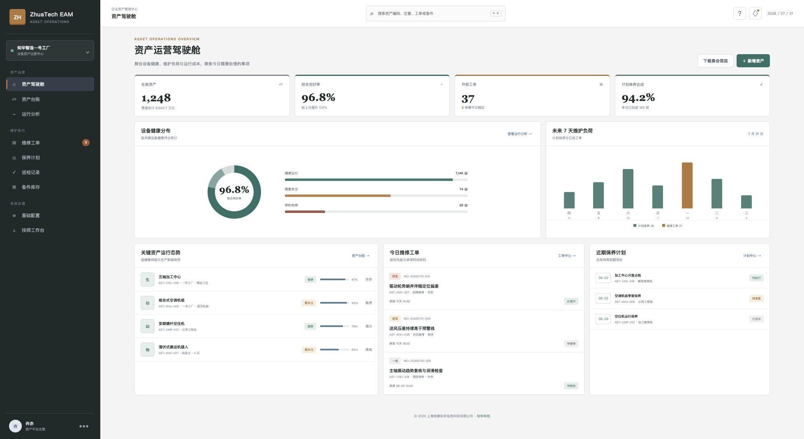
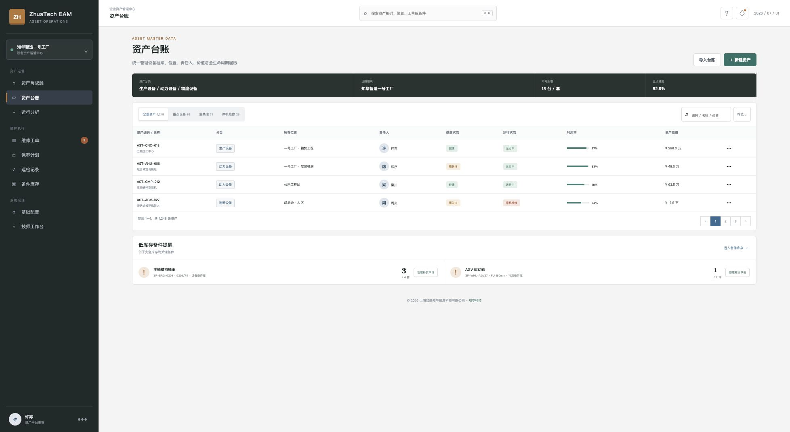
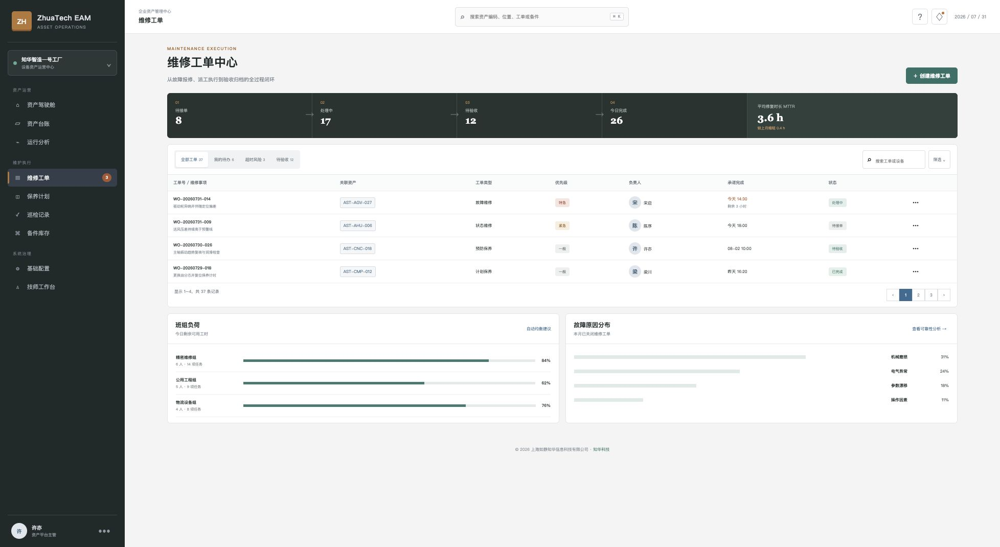
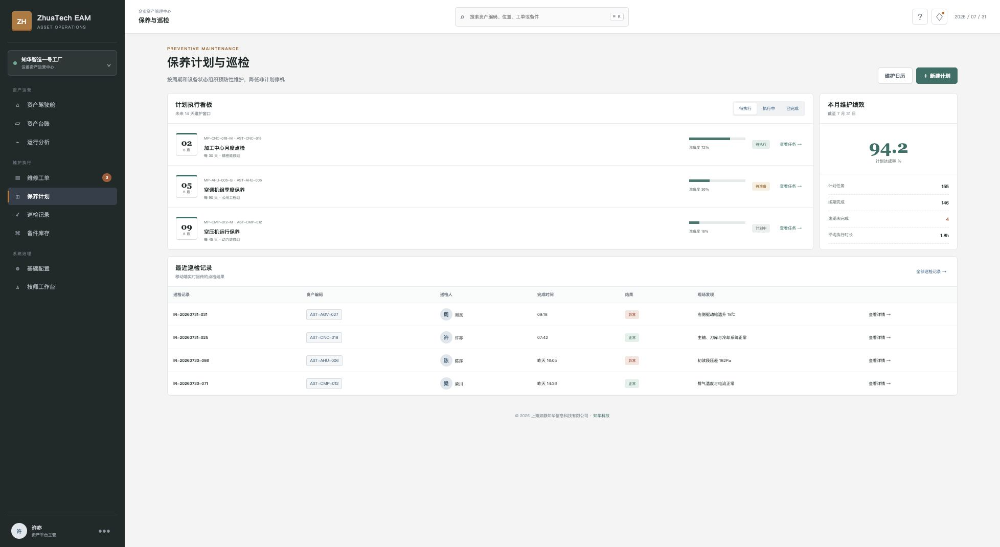
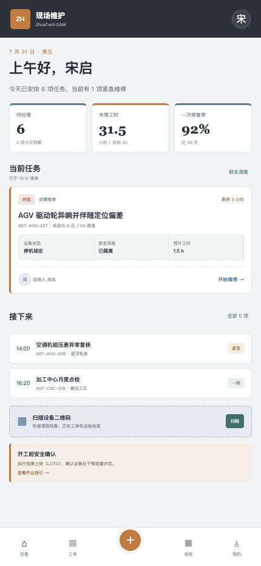

<!-- Copyright 2026 上海如静知华信息科技有限公司 -->

# ZhuaTech EAM · 知华科技企业资产管理系统

> 面向制造企业的资产与设备维护社区源码版，把“资产在哪里、状态怎么样、谁来维护、何时完成”沉淀在一套可运行的系统里。

[](backend/pom.xml)
[](backend/pom.xml)
[](frontend/package.json)
[](compose.yaml)
[](LICENSE)

ZhuaTech EAM 是由 **知华科技（上海如静知华信息科技有限公司）** 发布的企业资产管理系统社区源码版。工程采用 Java、Spring Boot、Vue 3、MySQL 的前后端分离架构，同时提供桌面管理端和现场技师 H5 工作台，可作为设备管理、维修工单、预防性维护、巡检管理和备件管理的学习参考与二次开发基础。

公司官网：[https://www.zhuatech.cn/](https://www.zhuatech.cn/)

> [!IMPORTANT]
> 本工程仅授权个人学习、技术研究与非商业交流。未经上海如静知华信息科技有限公司书面授权，不得用于企业生产经营、收费交付、SaaS、投标、培训收费或其他商业用途。需要商用、深度定制或项目实施，请联系知华科技取得授权。

## 从一次设备异常开始

```text
现场巡检发现异常 → 生成维修工单 → 调度派工 → 技师接单与安全确认
        ↑                                      ↓
   可靠性分析 ← 维修履历沉淀 ← 验收关闭 ← 用料、工时和故障原因回填
```

这条闭环贯穿桌面管理端和技师移动端。管理者看风险、计划与绩效，现场人员只看到当前需要执行的任务，减少在复杂菜单间切换。

## 真实界面

### 资产运营驾驶舱

聚合在册资产、综合完好率、开放工单、保养达成率、未来维护负荷和关键资产状态，用于设备晨会和维护资源安排。



### 资产台账

以唯一资产编码维护分类、位置、责任人、健康状态、运行状态、利用率和资产原值，并把低库存备件提醒放在操作上下文中。



### 维修工单中心

覆盖待接单、处理中、待验收和已完成状态，提供优先级、承诺时间、班组负荷、故障原因等运营信息。



### 保养计划与巡检

用未来维护窗口组织周期保养，跟踪计划准备度和达成率；现场巡检结果实时回传，异常记录可继续转为维修任务。



### 现场技师 H5 工作台

移动端围绕“当前任务”设计，包含接单、设备位置、安全隔离、预计工时、后续任务、扫码查档和 LOTO 安全提示。

<p align="center"></p>

## 能力范围

| 业务域 | 已提供能力 | 适合继续扩展 |
| --- | --- | --- |
| 资产台账 | 资产编码、分类、位置、责任人、原值、投运日期、健康与运行状态 | 资产层级、折旧、调拨、盘点、报废 |
| 维护计划 | 周期计划、下次执行日期、班组、计划状态与执行准备度 | 基于计量/状态的触发策略、停机窗口 |
| 维修工单 | 创建、优先级、派工、承诺时间、状态推进、验收闭环 | SLA、外委维修、费用归集、知识库 |
| 巡检管理 | 巡检人员、完成时间、结果与现场发现 | 路线、点位、仪表读数、离线巡检 |
| 备件库存 | 备件编码、规格、仓库、安全库存与缺货提醒 | 领退料、批次、采购申请、替代件 |
| 权限安全 | JWT 登录、角色授权、参数校验、统一异常响应 | 数据权限、单点登录、审计与密码策略 |

## 技术底座

| 层次 | 选型 |
| --- | --- |
| 管理端 / H5 | Vue 3、Vue Router、Pinia、Axios、Vite |
| 服务端 | Java 21、Spring Boot 4、Spring Security、Spring Data JPA |
| 数据与迁移 | MySQL 8、Flyway；测试使用 H2 MySQL 模式 |
| 认证 | JWT、BCrypt、角色级接口授权 |
| 工程化 | Docker Compose、Nginx、Maven、GitHub Actions |

核心 Java 包名为 `cn.zhuatech.eam`，Maven GroupId 为 `cn.zhuatech`。

## 五分钟运行

### Docker Compose

```bash
cp .env.example .env
# 修改 .env 中的数据库密码和 JWT 密钥
docker compose up --build -d
```

- Web：`http://localhost:8090`
- API：`http://localhost:8080`
- 健康检查：`http://localhost:8080/actuator/health`（如自行启用 Actuator）

### 本地开发

```bash
# 后端：Java 21 + Maven 3.9+
cd backend
mvn spring-boot:run

# 前端：Node.js 22+
cd frontend
npm install
npm run dev:demo
```

演示账号：

| 角色 | 账号 | 密码 |
| --- | --- | --- |
| 管理员 | `admin` | `admin123` |
| 资产管理员 | `asset` | `asset123` |
| 维修技师 | `technician` | `tech123` |

演示账号和密码只用于本地体验，任何部署都必须替换。

## API 入口

所有业务接口位于 `/api/eam`：

- `GET /dashboard`：资产运营驾驶舱
- `GET|POST /assets`：资产台账查询与新增
- `GET /maintenance-plans`：维护计划
- `GET|POST /work-orders`：维修工单查询与创建
- `PATCH /work-orders/{id}/advance`：推进工单状态
- `GET /inspections`：巡检记录
- `GET /spare-parts`：备件库存

完整说明见 [API 文档](docs/api.md)、[数据模型](docs/database.md) 与 [架构说明](docs/architecture.md)。

## 工程结构

```text
zhuatech-eam/
├── backend/                 Spring Boot 服务与集成测试
│   └── src/main/java/cn/zhuatech/eam/
├── frontend/                Vue 管理端与技师 H5
├── docs/                    架构、接口、数据模型及真实截图
├── deploy/                  部署说明
├── compose.yaml             MySQL + API + Web 编排
├── LICENSE                  非商业社区源码许可
└── README.md
```

## 社区版边界与生产建议

仓库提供可运行的基础闭环和演示数据，不包含企业生产环境通常需要的 IoT 数据采集、复杂点检路线、预测性维护算法、财务折旧、采购协同、租户隔离、工作流引擎、消息中心与商业支持承诺。生产部署前还应完成密钥替换、HTTPS、备份恢复、日志脱敏、数据权限、审计、监控告警和容量评估。

欢迎通过 Issue 提交不含敏感信息的问题与改进建议；提交代码前请阅读 [CONTRIBUTING.md](CONTRIBUTING.md) 与 [SECURITY.md](SECURITY.md)。

## 深度开发、商业授权与咨询

如果你需要企业资产管理系统定制、设备管理平台建设、EAM 与 ERP/MES/WMS 集成、移动巡检、IoT 采集、预测性维护或私有化部署，请联系 **知华科技（上海如静知华信息科技有限公司）**。

- 官网：[https://www.zhuatech.cn/](https://www.zhuatech.cn/)
- 微信咨询：扫描以下任一二维码

<table>
  <tr>
    <td align="center"><br>微信咨询一</td>
    <td align="center"><br>微信咨询二</td>
  </tr>
</table>

## 许可与版权

Copyright © 2026 **上海如静知华信息科技有限公司**。

本项目采用 [ZhuaTech Community Source License 1.0](LICENSE)。由于包含非商业限制，它不是 OSI 认定的开源许可证；对外发布时应准确描述为“社区源码版”。使用、修改或再分发即表示接受许可条款，并须保留版权、来源与 `NOTICE`。

## 设备健康优先级

`POST /api/eam/asset-health` 将温升、振动、近期故障、点检间隔和设备关键度转成统一风险分。高风险设备会明确要求创建工单，并返回振动复测、故障根因复盘与补充点检建议，适合接入设备驾驶舱和维修计划排程。

## 维护窗口决策

新增 `POST /api/eam/insights/maintenance-window`，比较故障风险敞口与计划停产损失，并校验停机窗口、备件和技术人员准备度，输出 `EXECUTE / PREPARE / DEFER`。设备管理团队可在生产损失、资产关键度和维护资源之间形成可审计的排程依据。
